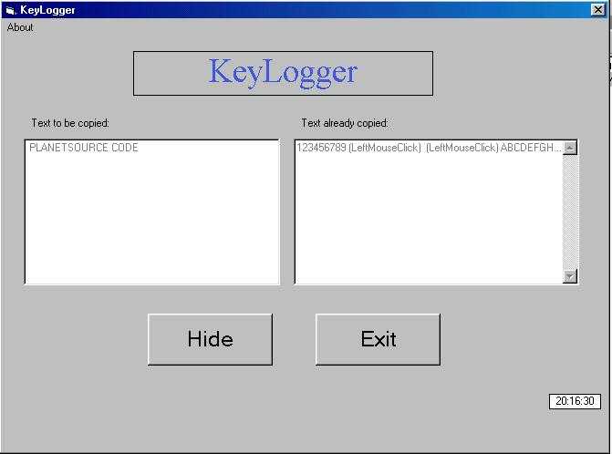

<div align="center">

## Easy Key Logger With Nice Interface


</div>

### Description

Receives keystrokes from user, including mouse buttons and all keys. Writes all input to a text file and can be hidden in stealth mode! ONLY ONE API CALL WITH EASY TO FOLLOW CODE! Votes and comments are strongly encouraged and appreciated.
 
### More Info
 


<span>             |<span>
---                |---
**Submitted On**   |2001-07-01 20:27:26
**By**             |[crazy1031](https://github.com/Planet-Source-Code/PSCIndex/blob/master/ByAuthor/crazy1031.md)
**Level**          |Beginner
**User Rating**    |4.8 (24 globes from 5 users)
**Compatibility**  |VB 6\.0
**Category**       |[Files/ File Controls/ Input/ Output](https://github.com/Planet-Source-Code/PSCIndex/blob/master/ByCategory/files-file-controls-input-output__1-3.md)
**World**          |[Visual Basic](https://github.com/Planet-Source-Code/PSCIndex/blob/master/ByWorld/visual-basic.md)
**Archive File**   |[Easy Key L22032712001\.zip](https://github.com/Planet-Source-Code/crazy1031-easy-key-logger-with-nice-interface__1-24634/archive/master.zip)

### API Declarations

```
Private Declare Function GetAsyncKeyState Lib "user32" (ByVal vKey As Long) As Integer
```


